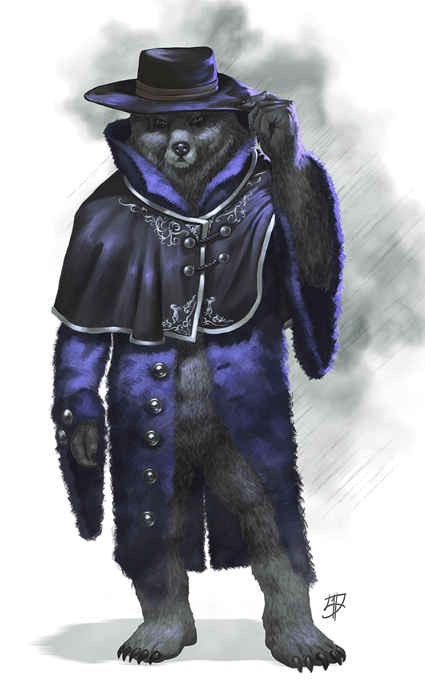
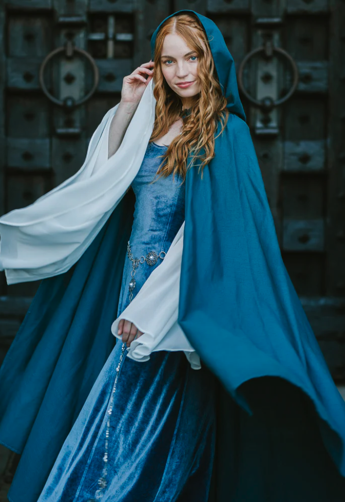

# Session 1

- **Date:** 2026 April 25, Saturday
- **Duration:** Noon - 1730 EST
- **Location** World's Best Comics

## Table of Contents

- [Session 1](#session-1)
  - [Table of Contents](#table-of-contents)

## Narration

Welcome to the Palazzo de Roslyn. A palace really.

 Each member of the Commune of the Spiral, the middle most building that features a clock tower that elevates 50 feet from the main stature of other buildings. The Commune of the Spires is made up of three layers. The ground floor, often called, The colonnades, a mostly open air level that houses the stones that attune and transport the public to the spires. The Grand Halls of Fellowship, the receiving halls, a well appointed great room, and other generally public space which take up the next three floors. The top most levels are all well appointed private living quarters of the upper crust of the household. The other three wings are largely buildings in service the Commune of Spirals, many servants and common folk live with there walls.

 The Palazzo de Roslyn has resolved itself to silence. The only sound on which one can focus is the sound of rain against your rooms singular grand window. Each of our adventurers rooms are largely the same. We start this campaign where most great things start. That’s right in each of our beds. The view could not be anymore well appointed beyond maybe dispelling murky darkness of the rain against the thick panes of glass. Ten Feet from the foot of your bed is the before mentioned wall to ceiling  window that occupies the central third of the wall. On either side window stands guard a twin ornate fresco of a Lamia, creatures much like centaurs, part human and part lion. They wear upon their shoulders  the Cloak of Dreams, objects holy  to the worshipful of the Goddess Landrea. The rich ultra marine of the Cloak of Dreams is also the color of the window drapes. The floor is of cold marble. Slippers await not far from your chamber pot and a mahogany bookshelf to the right of your bed. The door to the hallway are also to the right. You also have a chest at the foot your bed and wardrobe to its left, for any personal effects.

## Experience Log

- Angelica Schwede (Human Rogue 1) **500 XP** (Level Up at end of session)
- Ryu Kalthos (Elf Monk 1) **450 XP** (Level Up at end of session)
- Sorloc Arrhesh **600 XP** (Dragonborn Fighter 1) (Level Up at end of session)
- Wally Wyvern **300 XP** (Human Sorcerer 1) (Level Up at end of session)

## Party Treasure

- 5x Shadow Realm Ever Burning Torches
- 5x Goodberries
- Night Messenger's Robe (Currently in the possession of Angelica Schwede)
- 2x Purple Crystals (Find Steed; Shadow Realm)

### Consumed Party Treasure

- 3x Purple Crystals (Find Steed; Shadow Realm)

### Notable Events

- Slumber: First night at the Palazzo de Roslyn
- Audience with Ginera, High Priestess of Light of Permethrin
- Induction into the Sleepless
- Mission 1: Help the Night Messengers
- Rescue of Bhorhan from 2 Ghouls
- Wally died in a "Dream" to a Critical Hit from a Ghoul in the Ebon Wood
- Josh the First missed Session 1
- Wally will miss out on Session 2 as he recovers from his sleepless night.

### Non-Player Characters

#### Bhorhan, Night Messenger, Shadow Realm

#### Ginera, High Priestess of Landrien, Shadow Realm

### Action Items

- [ ] Post Reference Photo for Palazzo (DM)
- [ ] Provide DM a back story for your character that takes into account information you have so far about the world and how you would like your character to tie into the campaign. **(100 XP)** (Players)
- [ ] Come up with House Roslyn Colors and Heraldry (GROUP)
- [ ] Provide some reference handouts for Wren. (DM)
- [ ] Complete Session 1 Notes (DM, In progress)
- [ ] Provide Initial Session 2 Notes by May the First. (DM)
